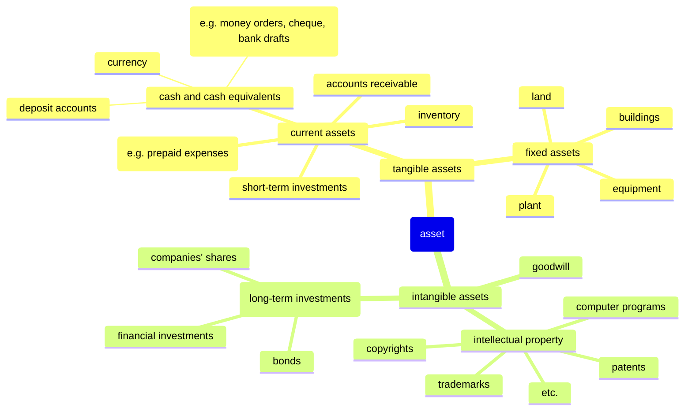

# Definition of assets

As introduced in Wikipedia entry “Asset”[^1]:

In financial accounting, an <i class="term">asset</i> is any resource owned or controlled by a business or an economic entity. It is anything (tangible or intangible) that <i class="emphasize">can be used to produce positive economic value</i>. Assets represent value of ownership that can be converted into cash (although cash itself is also considered an asset). The <i class="term">balance sheet</i> of a firm records the monetary value of the assets owned by that firm. It covers money and other valuables belonging to an individual or to a business. Total assets can also be called the balance sheet total.

and the formal definition of asset[^1] from International Financial Reporting Standards (IFRS)[^3]:

IFRS (International Financial Reporting Standards), the most widely used financial reporting system, defines: "An asset is a present economic resource controlled by the entity as a result of past events. An economic resource is a right that has the potential to produce economic benefits."

and the accounting definition of assets and the characteristics of assets from *Chapter 4: Elements of Financial Statements* of the document *Statement of Financial Accounting Concepts No.8 (December 2021)* (i.e. Generally Accepted Accounting Principles used in the United States of America, USGAAP)[^4]:

E 17. An asset has the following two essential characteristics:

a. **It is a present right.**

b. **The right is to an economic benefit.**

The combination of those two characteristics allows an entity to obtain the economic benefit and control others’ access to the benefit. A present right of an entity to an economic benefit entitles the entity to the economic benefit and the ability to restrict others’ access to the benefit to which the entity is entitled.

E18. Assets commonly have features that help identify them---for example, assets may be contractual, tangible, exchangeable, or separable. However, those features are not essential characteristics of assets. Their absence is not sufficient to preclude an item from qualifying as an asset.

 

This <i class="emphasize">accounting definition</i> of assets includes items that are not owned by an enterprise, for example a leased building (Finance lease), but excludes employees because, while they have the capacity to generate economic benefits, <i class="emphasize">an employer cannot control an employee</i>.[^1]

which stresses the importance of control when identifying an asset[^1]:

The essential characteristic of control is the ability to benefit from the asset and prevent other entities from doing likewise. The IFRS conceptual framework explains (CF 4.20): An entity controls an economic resource if it has the present ability to direct the use of the economic resource and obtain the economic benefits that may flow from it. Control includes the present ability to prevent other parties from directing the use of the economic resource and from obtaining the economic benefits that may flow from it. It follows that, <i class="emphasize">if one party controls an economic resource, no other party controls that resource</i>.

in all, we can feel that the value of assets lies in generating economic benefit. While at times this sort of economic benefit is negative, people expect or believe it is positive at the beginning when they choose to possess (or rather, control, or, have a right of) an asset. I think this is why Warren Buffett, as the most famous exampler of value investing, doesn’t like investing real estates, especially luxury house for self living, cars, gold, cash (he prefers a good business to cash[^8]), or crypto currencies[^9][^10], which are the most extreme and most representative examples. They’ll produce less values (and hence profits), and what prompts their price is just people’s expectation that ones who come later in future will pay more for exchanging them. It is a speculation, rather than investment.

 

# Assets on balance sheet

On the balance sheet, assets of a company are the sum of liabilities and equity[^1]:

The accounting equation is the mathematical structure of the balance sheet. It relates assets, liabilities, and owner's equity:

Assets = Liabilities + Equity (in financial accounting, the term equity, not Capital, is used)

Liabilities = Assets − Equity

Equity = Assets − Liabilities

Assets are reported on the balance sheet. On the balance sheet, additional sub-classifications are generally required by generally accepted accounting principles (GAAP)[^5], <i class="emphasize">which vary from country to country</i>.

In finance, <i class="term">equity</i> is an ownership interest in property that may be offset by debts or other liabilities. Equity is measured for accounting purposes by subtracting liabilities from the value of the assets owned. For example, if someone owns a car worth \\$24,000 and owes \\$10,000 on the loan used to buy the car, the difference of \\$14,000 is equity. Equity can apply to a single asset, such as a car or house, or to an entire business. A business that needs to start up or expand its operations can sell its equity in order to raise cash that does not have to be repaid on a set schedule. When liabilities attached to an asset exceed its value, the difference is called a deficit and the asset is informally said to be "underwater" or "upside-down". In government finance or other non-profit settings, equity is known as "<i class="term">net position</i>" or "<i class="term">net assets</i>".[^2]

and maybe this is why liabilities and assets will shrink simultaneously in a balance sheet recession[^6].

 

On basis of different categorizations, assets on the balance sheet can be classified into current and non-current (a.k.a. fixed or long-lived)[^1]:

Current assets are generally subclassified as cash and cash equivalents, receivables, inventory, and accruals (such as pre-paid expenses). Non-current assets are generally subclassified as investments (financial instruments), property, plant and equipment, intangible assets (including goodwill) and other assets (such as resources or biological assets).

or other two classes, tangible assets and intangible assets[^1]:

It should be noted that, “short-term investments: include securities bought and held for sale in the near future to generate income on short-term price differences”[^1] belong to current asset, while “long-term investments” intangible assets[^7].

**Long-term investments**

Often referred to simply as "investments". Long-term investments are to be held for many years and are not intended to be disposed of in the near future. This group usually consists of three types of investments :

1. Investments in securities such as bonds, common stock, or long-term notes
2. Investments in fixed assets not used in operations (e.g., land held for sale)
3. Investments in special funds (e.g. sinking funds or pension funds).
4. Different forms of insurance may also be treated as long-term investments.

Different forms of insurance may also be treated as long-term investments.

 

# Development of definition of assets

At last, with the development of society, the definition of assets is also progressing[^1]:

There is a growing analytical interest in assets and asset forms in other social sciences too, especially in terms of how a variety of things (e.g., personality, personal data, ecosystems, etc.) can be turned into an asset.

Discussions about this aspect, such as personal data and privacy, may involve people’s opinions on humanities and ethics.

 

**References**

[^1]: [Asset](https://en.wikipedia.org/wiki/Asset).
[^2]: [Equity (finance)](https://en.wikipedia.org/wiki/Equity_\(finance\)).
[^3]: [AP2B: Definitions of asset and liability](https://www.ifrs.org/content/dam/ifrs/meetings/2014/may/eeg/conceptual-framework/ap2b-definitions-of-asset-and-liability.pdf).
[^4]: [CONCEPTS STATEMENT NO. 8—CONCEPTUAL FRAMEWORK FOR FINANCIAL REPORTING—CHAPTER 4, ELEMENTS OF FINANCIAL STATEMENTS](https://www.fasb.org/Page/ShowPdf?path=Concepts_Statement_8-Chapter_4-Elements.pdf&title=CONCEPTS+STATEMENT+NO.+8%E2%80%94CONCEPTUAL+FRAMEWORK+FOR+FINANCIAL+REPORTING%E2%80%94CHAPTER+4%2C+ELEMENTS+OF+FINANCIAL+STATEMENTS&acceptedDisclaimer=true&Submit=).
[^5]: [Accounting standard](https://en.wikipedia.org/wiki/Accounting_standard).
[^6]: [Balance sheet recession](https://en.wikipedia.org/wiki/Balance_sheet_recession).
[^7]: [What Is an Intangible Asset?](https://www.investopedia.com/terms/i/intangibleasset.asp).
[^8]: [Warren Buffett: Cash is NOT King](https://www.youtube.com/watch?v=MjxTvZRqCYc).
[^9]: [Warren Buffett: Bitcoin Is An Asset That Creates Nothing \| CNBC](https://www.youtube.com/watch?v=LtITDtZPYEw).
[^10]: [Warren Buffett, Bill Gates Blast Bitcoin as 'Non-Productive Asset,' Bad Investment](https://www.newsweek.com/bitcoin-bill-gates-warren-buffett-cryptocurrency-berkshire-hathaway-investment-912850).