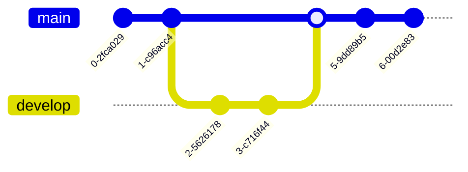

# Introduction

Mermaid is a diagramming and charting tool[^4]:

<div class="quote--left">JavaScript based diagramming and charting tool that renders Markdown-inspired text definitions to create and modify diagrams dynamically.</div>

and Markdown editor Typora naturally supported using Mermaid syntax to make diagrams[^1]. Take the first example, Sequence Diagram, on Typora documentation[^1]. If we type the following code snippet in Typora editor:

<div id="mermaid-1"></div>

````

````

NOTE: the code for diagramming must be wrapped in fenced code block whose name is `mermaid`.
{: .notice--primary}


correspondingly, we’ll have a rendered diagram in Typora:


On the other hand, static website generator Jekyll can render Markdown files into webpages, but at this time, it can’t interpret above [Mermaid diagramming code](#mermaid-1) well:

<div id="html-element"></div>

 

To make Mermaid available in webpages, it is a method to add Mermaid JavaScript file by CDN[^2]:

<div id="script-1"></div>

```html
<head>
  <script src="https://cdn.jsdelivr.net/npm/mermaid@10.9.1/dist/mermaid.min.js"></script>
</head>
```

and then use HTML `<div>` element to wrap Mermaid code, that is:

```html
<div class="mermaid">
    %% Example of sequence diagram
  sequenceDiagram
    Alice->>Bob: Hello Bob, how are you?
    alt is sick
    Bob->>Alice: Not so good :(
    else is well
    Bob->>Alice: Feeling fresh like a daisy
    end
    opt Extra response
    Bob->>Alice: Thanks for asking
    end
</div>
```

<div class="mermaid">
    %% Example of sequence diagram
  sequenceDiagram
    Alice->>Bob: Hello Bob, how are you?
    alt is sick
    Bob->>Alice: Not so good :(
    else is well
    Bob->>Alice: Feeling fresh like a daisy
    end
    opt Extra response
    Bob->>Alice: Thanks for asking
    end
</div>

As can be seen, it works. But, Typora can’t render this division with `class="mermaid"` correctly:


So, my next goal is to find a way to render Mermaid code normally in both Typora editor and Jekyll webpages. It sounds more difficult for me to make Typora correctly interpret those `<div>` elements with a certain class name, `"mermaid"` is this case, because to this end I should add some extra configurations for Typora that is installed locally. So, I decided to make browser be able to understand the [Mermaid diagramming code in Markdown form](#mermaid-1) well.

I inspect [the element](#html-element) rendered by [the Markdown code](#mermaid-1) in browser, and find its HTML source code is:

```html
<code class="language-mermaid">%% Example of sequence diagram
  sequenceDiagram
    Alice-&gt;&gt;Bob: Hello Bob, how are you?
    alt is sick
    Bob-&gt;&gt;Alice: Not so good :(
    else is well
    Bob-&gt;&gt;Alice: Feeling fresh like a daisy
    end
    opt Extra response
    Bob-&gt;&gt;Alice: Thanks for asking
    end
</code>
```

So, I thought of using JavaScript code to find those `<code>` elements with `class="language-mermaid"`, and change their class name to `"mermaid"` by:

```html
<script type="text/javascript">
    const codeElements = document.querySelectorAll('code[class*="language-mermaid"]');
    codeElements.forEach(function (element) {
      if (element.classList.contains('language-mermaid')) {
        element.classList.replace('language-mermaid', 'mermaid');
      }
    });
</script>
```

After it, [the Markdown code](#mermaid-1) can generate Mermaid diagram successfully in Typora and webpages.

In documentations[^1] and[^2] there are some Mermaid examples, showing how to use Mermaid syntax to generate different kinds of diagrams. So, in the following text I’ll record some of them.

<br>

# Mermaid Examples

## Sequence Diagrams

````

````


<br>

## Flowcharts

````

````


<br>

## Gantt Charts

````

````


<br>

## Bar Charts (using gantt chart)

````

````


<br>

## Class Diagrams

````

````


<br>

## State Diagrams

````

````


<br>

## Pie Charts


````

````


<br>

## Requirement Diagrams

````

````


<br>

## Gitgraph Diagrams / Commit Flow Diagrams

````

````


<br>

## Mindamp

````
```mermaid
mindmap
  root((mindmap))
    Origins
      Long history
      ::icon(fa fa-book)
      Popularisation
        British popular psychology author Tony Buzan
    Research
      On effectiveness<br/>and features
      On Automatic creation
        Uses
            Creative techniques
            Strategic planning
            Argument mapping
    Tools
      Pen and paper
      Mermaid
```
````

```mermaid
mindmap
  root((mindmap))
    Origins
      Long history
      ::icon(fa fa-book)
      Popularisation
        British popular psychology author Tony Buzan
    Research
      On effectiveness<br/>and features
      On Automatic creation
        Uses
            Creative techniques
            Strategic planning
            Argument mapping
    Tools
      Pen and paper
      Mermaid
```

<br>

## Timeline

````
```mermaid
timeline
    title History of Social Media Platform
    2002 : LinkedIn
    2004 : Facebook : Google
    2005 : Youtube
    2006 : Twitter
```
````

```mermaid
timeline
    title History of Social Media Platform
    2002 : LinkedIn
    2004 : Facebook : Google
    2005 : Youtube
    2006 : Twitter
```

<br>

## Quadrant Charts

````
```mermaid
quadrantChart
    title Reach and engagement of campaigns
    x-axis Low Reach --> High Reach
    y-axis Low Engagement --> High Engagement
    quadrant-1 We should expand
    quadrant-2 Need to promote
    quadrant-3 Re-evaluate
    quadrant-4 May be improved
    Campaign A: [0.3, 0.6]
    Campaign B: [0.45, 0.23]
    Campaign C: [0.57, 0.69]
    Campaign D: [0.78, 0.34]
    Campaign E: [0.40, 0.34]
    Campaign F: [0.35, 0.78]
```
````

```mermaid
quadrantChart
    title Reach and engagement of campaigns
    x-axis Low Reach --> High Reach
    y-axis Low Engagement --> High Engagement
    quadrant-1 We should expand
    quadrant-2 Need to promote
    quadrant-3 Re-evaluate
    quadrant-4 May be improved
    Campaign A: [0.3, 0.6]
    Campaign B: [0.45, 0.23]
    Campaign C: [0.57, 0.69]
    Campaign D: [0.78, 0.34]
    Campaign E: [0.40, 0.34]
    Campaign F: [0.35, 0.78]
```

<br>

## Sankey Diagrams

````
```mermaid
---
config:
  sankey:
    showValues: false
---
sankey-beta

Agricultural 'waste',Bio-conversion,124.729
Bio-conversion,Liquid,0.597
Bio-conversion,Losses,26.862
Bio-conversion,Solid,280.322
Bio-conversion,Gas,81.144
Biofuel imports,Liquid,35
Biomass imports,Solid,35
Coal imports,Coal,11.606
Coal reserves,Coal,63.965
Coal,Solid,75.571
District heating,Industry,10.639
District heating,Heating and cooling - commercial,22.505
District heating,Heating and cooling - homes,46.184
Electricity grid,Over generation / exports,104.453
Electricity grid,Heating and cooling - homes,113.726
Electricity grid,H2 conversion,27.14
Electricity grid,Industry,342.165
Electricity grid,Road transport,37.797
Electricity grid,Agriculture,4.412
Electricity grid,Heating and cooling - commercial,40.858
Electricity grid,Losses,56.691
Electricity grid,Rail transport,7.863
Electricity grid,Lighting & appliances - commercial,90.008
Electricity grid,Lighting & appliances - homes,93.494
Gas imports,Ngas,40.719
Gas reserves,Ngas,82.233
Gas,Heating and cooling - commercial,0.129
Gas,Losses,1.401
Gas,Thermal generation,151.891
Gas,Agriculture,2.096
Gas,Industry,48.58
Geothermal,Electricity grid,7.013
H2 conversion,H2,20.897
H2 conversion,Losses,6.242
H2,Road transport,20.897
Hydro,Electricity grid,6.995
Liquid,Industry,121.066
Liquid,International shipping,128.69
Liquid,Road transport,135.835
Liquid,Domestic aviation,14.458
Liquid,International aviation,206.267
Liquid,Agriculture,3.64
Liquid,National navigation,33.218
Liquid,Rail transport,4.413
Marine algae,Bio-conversion,4.375
Ngas,Gas,122.952
Nuclear,Thermal generation,839.978
Oil imports,Oil,504.287
Oil reserves,Oil,107.703
Oil,Liquid,611.99
Other waste,Solid,56.587
Other waste,Bio-conversion,77.81
Pumped heat,Heating and cooling - homes,193.026
Pumped heat,Heating and cooling - commercial,70.672
Solar PV,Electricity grid,59.901
Solar Thermal,Heating and cooling - homes,19.263
Solar,Solar Thermal,19.263
Solar,Solar PV,59.901
Solid,Agriculture,0.882
Solid,Thermal generation,400.12
Solid,Industry,46.477
Thermal generation,Electricity grid,525.531
Thermal generation,Losses,787.129
Thermal generation,District heating,79.329
Tidal,Electricity grid,9.452
UK land based bioenergy,Bio-conversion,182.01
Wave,Electricity grid,19.013
Wind,Electricity grid,289.366
```
````

```mermaid
---
config:
  sankey:
    showValues: false
---
sankey-beta

Agricultural 'waste',Bio-conversion,124.729
Bio-conversion,Liquid,0.597
Bio-conversion,Losses,26.862
Bio-conversion,Solid,280.322
Bio-conversion,Gas,81.144
Biofuel imports,Liquid,35
Biomass imports,Solid,35
Coal imports,Coal,11.606
Coal reserves,Coal,63.965
Coal,Solid,75.571
District heating,Industry,10.639
District heating,Heating and cooling - commercial,22.505
District heating,Heating and cooling - homes,46.184
Electricity grid,Over generation / exports,104.453
Electricity grid,Heating and cooling - homes,113.726
Electricity grid,H2 conversion,27.14
Electricity grid,Industry,342.165
Electricity grid,Road transport,37.797
Electricity grid,Agriculture,4.412
Electricity grid,Heating and cooling - commercial,40.858
Electricity grid,Losses,56.691
Electricity grid,Rail transport,7.863
Electricity grid,Lighting & appliances - commercial,90.008
Electricity grid,Lighting & appliances - homes,93.494
Gas imports,Ngas,40.719
Gas reserves,Ngas,82.233
Gas,Heating and cooling - commercial,0.129
Gas,Losses,1.401
Gas,Thermal generation,151.891
Gas,Agriculture,2.096
Gas,Industry,48.58
Geothermal,Electricity grid,7.013
H2 conversion,H2,20.897
H2 conversion,Losses,6.242
H2,Road transport,20.897
Hydro,Electricity grid,6.995
Liquid,Industry,121.066
Liquid,International shipping,128.69
Liquid,Road transport,135.835
Liquid,Domestic aviation,14.458
Liquid,International aviation,206.267
Liquid,Agriculture,3.64
Liquid,National navigation,33.218
Liquid,Rail transport,4.413
Marine algae,Bio-conversion,4.375
Ngas,Gas,122.952
Nuclear,Thermal generation,839.978
Oil imports,Oil,504.287
Oil reserves,Oil,107.703
Oil,Liquid,611.99
Other waste,Solid,56.587
Other waste,Bio-conversion,77.81
Pumped heat,Heating and cooling - homes,193.026
Pumped heat,Heating and cooling - commercial,70.672
Solar PV,Electricity grid,59.901
Solar Thermal,Heating and cooling - homes,19.263
Solar,Solar Thermal,19.263
Solar,Solar PV,59.901
Solid,Agriculture,0.882
Solid,Thermal generation,400.12
Solid,Industry,46.477
Thermal generation,Electricity grid,525.531
Thermal generation,Losses,787.129
Thermal generation,District heating,79.329
Tidal,Electricity grid,9.452
UK land based bioenergy,Bio-conversion,182.01
Wave,Electricity grid,19.013
Wind,Electricity grid,289.366
```

<br>

## ZenUML

````
```mermaid
zenuml
    title Demo
    Alice->John: Hello John, how are you?
    John->Alice: Great!
    Alice->John: See you later!
```
````

```mermaid
zenuml
    title Demo
    Alice->John: Hello John, how are you?
    John->Alice: Great!
    Alice->John: See you later!
```

As can be seen, an error occurs, but it renders well in Typora. As in the documentation[^3]:

<div class="quote--left" markdown="1">
Mermaid can render sequence diagrams with [ZenUML](https://zenuml.com/). Note that ZenUML uses a different syntax than the original Sequence Diagram in mermaid.

......

**Integrating with your library/website.**

Zenuml uses the experimental lazy loading & async rendering features which could change in the future.

You can use this method to add mermaid including the zenuml diagram to a web page:

<div id="script-2"></div>

```html
<script type="module">
  import mermaid from 'https://cdn.jsdelivr.net/npm/mermaid@10/dist/mermaid.esm.min.mjs';
  import zenuml from 'https://cdn.jsdelivr.net/npm/@mermaid-js/mermaid-zenuml@0.1.0/dist/mermaid-zenuml.esm.min.mjs';
  await mermaid.registerExternalDiagrams([zenuml]);
</script>
```

</div>

ZenUML seems relatively standalone and needs to import other modules from CDN. If I replace [Script 1](#script-1) with [Script 2](#script-2), this ZenUML diagram appears normally in webpage, but meanwhile, many elements, such as Caption and Back-To-Top button (along with some others), happen to change:


I haven’t found any other way to correct it, so finally I choose [Script 1](#script-1), rather than [Script 2](#script-2), to import Mermaid from CDN, leaving aside this error.

<br>

## XY Charts

````
```mermaid
xychart-beta
    title "Sales Revenue"
    x-axis [jan, feb, mar, apr, may, jun, jul, aug, sep, oct, nov, dec]
    y-axis "Revenue (in $)" 4000 --> 11000
    bar [5000, 6000, 7500, 8200, 9500, 10500, 11000, 10200, 9200, 8500, 7000, 6000]
    line [5000, 6000, 7500, 8200, 9500, 10500, 11000, 10200, 9200, 8500, 7000, 6000]
```
````

```mermaid
xychart-beta
    title "Sales Revenue"
    x-axis [jan, feb, mar, apr, may, jun, jul, aug, sep, oct, nov, dec]
    y-axis "Revenue (in $)" 4000 --> 11000
    bar [5000, 6000, 7500, 8200, 9500, 10500, 11000, 10200, 9200, 8500, 7000, 6000]
    line [5000, 6000, 7500, 8200, 9500, 10500, 11000, 10200, 9200, 8500, 7000, 6000]
```

<br>

## User Journey Diagrams

````
```mermaid
  journey
    title My working day
    section Go to work
      Make tea: 5: Me
      Go upstairs: 3: Me
      Do work: 1: Me, Cat
    section Go home
      Go downstairs: 5: Me
      Sit down: 3: Me
```
````

```mermaid
  journey
    title My working day
    section Go to work
      Make tea: 5: Me
      Go upstairs: 3: Me
      Do work: 1: Me, Cat
    section Go home
      Go downstairs: 5: Me
      Sit down: 3: Me
```

<br>

## C4 Diagrams

````
```mermaid
C4Context
title System Context diagram for Internet Banking System

Person(customerA, "Banking Customer A", "A customer of the bank, with personal bank accounts.")
Person(customerB, "Banking Customer B")
Person_Ext(customerC, "Banking Customer C")
System(SystemAA, "Internet Banking System", "Allows customers to view information about their bank accounts, and make payments.")

Person(customerD, "Banking Customer D", "A customer of the bank, <br/> with personal bank accounts.")

Enterprise_Boundary(b1, "BankBoundary") {

  SystemDb_Ext(SystemE, "Mainframe Banking System", "Stores all of the core banking information about customers, accounts, transactions, etc.")

  System_Boundary(b2, "BankBoundary2") {
    System(SystemA, "Banking System A")
    System(SystemB, "Banking System B", "A system of the bank, with personal bank accounts.")
  }

  System_Ext(SystemC, "E-mail system", "The internal Microsoft Exchange e-mail system.")
  SystemDb(SystemD, "Banking System D Database", "A system of the bank, with personal bank accounts.")

  Boundary(b3, "BankBoundary3", "boundary") {
    SystemQueue(SystemF, "Banking System F Queue", "A system of the bank, with personal bank accounts.")
    SystemQueue_Ext(SystemG, "Banking System G Queue", "A system of the bank, with personal bank accounts.")
  }
}

BiRel(customerA, SystemAA, "Uses")
BiRel(SystemAA, SystemE, "Uses")
Rel(SystemAA, SystemC, "Sends e-mails", "SMTP")
Rel(SystemC, customerA, "Sends e-mails to")
```
````

```mermaid
C4Context
title System Context diagram for Internet Banking System

Person(customerA, "Banking Customer A", "A customer of the bank, with personal bank accounts.")
Person(customerB, "Banking Customer B")
Person_Ext(customerC, "Banking Customer C")
System(SystemAA, "Internet Banking System", "Allows customers to view information about their bank accounts, and make payments.")

Person(customerD, "Banking Customer D", "A customer of the bank, <br/> with personal bank accounts.")

Enterprise_Boundary(b1, "BankBoundary") {

  SystemDb_Ext(SystemE, "Mainframe Banking System", "Stores all of the core banking information about customers, accounts, transactions, etc.")

  System_Boundary(b2, "BankBoundary2") {
    System(SystemA, "Banking System A")
    System(SystemB, "Banking System B", "A system of the bank, with personal bank accounts.")
  }

  System_Ext(SystemC, "E-mail system", "The internal Microsoft Exchange e-mail system.")
  SystemDb(SystemD, "Banking System D Database", "A system of the bank, with personal bank accounts.")

  Boundary(b3, "BankBoundary3", "boundary") {
    SystemQueue(SystemF, "Banking System F Queue", "A system of the bank, with personal bank accounts.")
    SystemQueue_Ext(SystemG, "Banking System G Queue", "A system of the bank, with personal bank accounts.")
  }
}

BiRel(customerA, SystemAA, "Uses")
BiRel(SystemAA, SystemE, "Uses")
Rel(SystemAA, SystemC, "Sends e-mails", "SMTP")
Rel(SystemC, customerA, "Sends e-mails to")
```

<br>

**References**

[^1]: [Draw Diagrams With Markdown: mermaid - Typora Support](https://support.typora.io/Draw-Diagrams-With-Markdown/#mermaid).
[^2]: [mermaid CDN by jsDelivr - A CDN for npm and GitHub](https://www.jsdelivr.com/package/npm/mermaid).
[^3]: [ZenUML \| Mermaid](https://mermaid.js.org/syntax/zenuml.html).
[^4]: [Mermaid \|Diagramming and charting tool](https://mermaid.js.org/).
